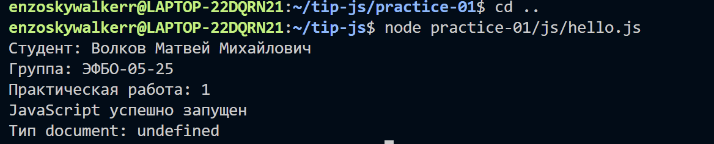
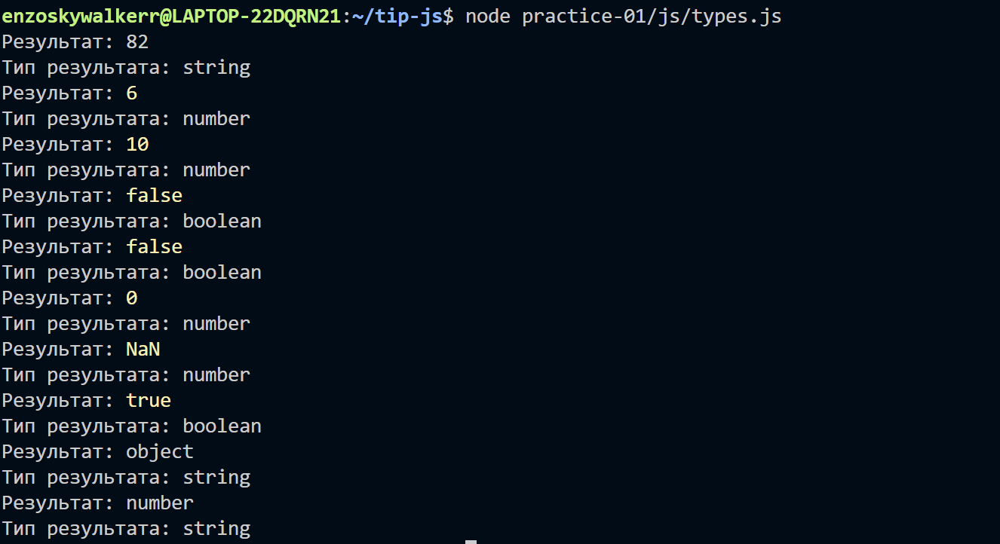
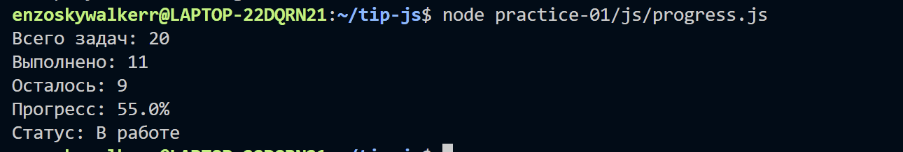
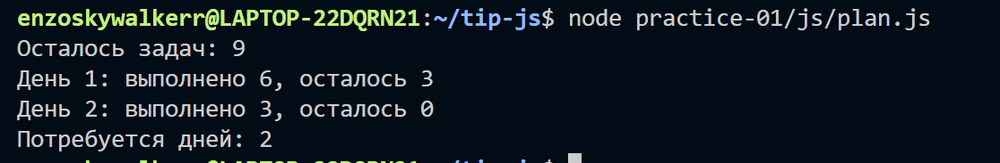
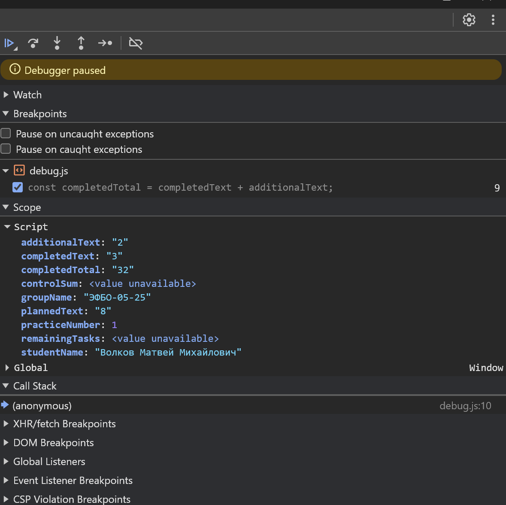

# Практическая работа № 1 - отчёт

## 1. Автор и вариант

| Поле | Значение |
|---|---|
| Студент | Волков Матвей Михайлович |
| Группа | ЭФБО-05-25 |
| Номер в журнале (N) | 4 |
| Вариант | ((4 - 1) % 8) + 1 = 4 |
| Набор варианта (задания 3 и 4) | totalTasks = 20, completedTasks = 11, dailyLimit = 6 |

## 2. Окружение

| Инструмент | Версия |
|---|---|
| ОС | WSL2, Linux 6.6.87.2-microsoft-standard-WSL2 (x86_64) |
| Node.js | v20.20.2 |
| npm | 10.8.2 |
| Git | 2.43.0 |
| Браузер | Chromium-браузер с инструментами разработчика |

Примечание: методичка рекомендует ветку Node.js 24 LTS. Установлена v20.20.2 (другая LTS-линия), код на ней работает корректно. Код запускается в Node.js и браузере.

## 3. Запуск

Команды выполняются из корня репозитория:

```bash
node practice-01/js/hello.js
node practice-01/js/types.js
node practice-01/js/progress.js
node practice-01/js/plan.js
node practice-01/js/debug.js
```

В браузере: открыть `practice-01/index.html` как локальный файл. В `index.html` в каждый момент подключён один учебный файл через `<script src="./js/имя.js" defer>`. Для проверки другого задания путь в `script` меняется, файл сохраняется, страница перезагружается, результат смотрим во вкладке Console. Перед сдачей в `index.html` возвращено подключение `./js/hello.js`.

## 4. Задание 1. Один файл - две среды выполнения

Файл `js/hello.js` запущен двумя способами.

| Среда | Где появился вывод | typeof document |
|---|---|---|
| Node.js | прямо в терминале | undefined |
| Браузер (вкладка Console) | во вкладке Console, не на странице | object |

Различие последней строки: объект `document` (DOM страницы) даёт среда браузера. При обычном запуске через Node.js страница не создаётся, поэтому `document` не определён. `console.log()` выводит текст только в консоль и не добавляет его на страницу.



## 5. Задание 2. Исследование типов и преобразований

Файл `js/types.js`, все десять выражений проверены через `console.log()`.

| № | Выражение | Ожидание до запуска | Фактическое значение | Тип результата | Объяснение |
|---|---|---|---|---|---|
| 1 | "8" + 2 | "82", string | 82 | string | Плюс со строкой выполняет конкатенацию, число превращается в текст. |
| 2 | "8" - 2 | 6, number | 6 | number | Для минуса строки нет, поэтому строка приводится к числу. |
| 3 | Number("8") + 2 | 10, number | 10 | number | Number() явно преобразует строку в число. |
| 4 | "12" > "3" | true | false | boolean | Строки сравниваются посимвольно, символ "1" меньше "3". |
| 5 | 12 === "12" | false | false | boolean | Строгое равенство не приводит типы. |
| 6 | Number("") | 0 | 0 | number | Пустая строка преобразуется в 0. |
| 7 | Number("text") | NaN, number | NaN | number | Непереводимая строка даёт NaN. |
| 8 | Boolean("false") | true | true | boolean | Непустая строка всегда истинна, текст не выполняется. |
| 9 | typeof null | "object" | object | string | Историческая особенность: typeof null возвращает "object". |
| 10 | typeof NaN | "number" | number | string | NaN считается числом, тип NaN - number, а typeof всегда возвращает строку. |

Вывод: одного `typeof` или `Number()` недостаточно для проверки чисел, поэтому в заданиях 3 и 4 использованы `Number.isNaN` и `Number.isInteger`.



## 6. Задание 3. Сводка выполнения задач

Файл `js/progress.js`. Расчёты не захардкожены, статус определяется по исходным количествам, при нулевых данных деления на ноль нет.

| Проверка | Входные данные | Ожидаемый результат | Фактический результат | Итог |
|---|---|---|---|---|
| Обычный случай | 12, 5 | Осталось 7; 41.7%; «В работе» | Всего задач: 12; Выполнено: 5; Осталось: 7; Прогресс: 41.7%; Статус: В работе | Пройдено |
| Ноль задач | 0, 0 | «Задач пока нет», без процента | Задач пока нет | Пройдено |
| Не начато | 5, 0 | Осталось 5; 0.0%; «Не начато» | Всего задач: 5; Выполнено: 0; Осталось: 5; Прогресс: 0.0%; Статус: Не начато | Пройдено |
| Завершено | 5, 5 | Осталось 0; 100.0%; «Завершено» | Всего задач: 5; Выполнено: 5; Осталось: 0; Прогресс: 100.0%; Статус: Завершено | Пройдено |
| Выполнено больше, чем существует | 5, 6 | Ошибка | Ошибка: выполнено больше, чем существует | Пройдено |
| Отрицательное количество | -1, 0 | Ошибка | Ошибка: отрицательное количество | Пройдено |
| Дробное количество | 5, 2.5 | Ошибка | Ошибка: дробное количество | Пройдено |
| Строка вместо числа | "5", 2 | Ошибка | Ошибка: вместо числа передана строка | Пройдено |
| Верхняя граница | 1001, 0 | Ошибка | Ошибка: превышена верхняя граница | Пройдено |
| NaN | NaN, 0 | Ошибка | Ошибка: недопустимое числовое значение | Пройдено |
| Свой вариант | 20, 11 | Осталось 9; 55.0%; «В работе» | Всего задач: 20; Выполнено: 11; Осталось: 9; Прогресс: 55.0%; Статус: В работе | Пройдено |

## 7. Задание 4. План выполнения задач по дням

Файл `js/plan.js`. Использован цикл `while`, за последний день выполняется не больше, чем осталось (`Math.min`), остаток не становится отрицательным, недопустимый ввод не запускает цикл.

| Проверка | Входные данные | Ожидаемый результат | Фактический результат | Итог |
|---|---|---|---|---|
| Обычный случай | 12, 5, 3 | 3 дня, в последний день 1 задача | Осталось задач: 7; День 1: выполнено 3, осталось 4; День 2: выполнено 3, осталось 1; День 3: выполнено 1, осталось 0; Потребуется дней: 3 | Пройдено |
| Равные блоки | 10, 4, 3 | 2 дня по 3 задачи | Осталось задач: 6; День 1: выполнено 3, осталось 3; День 2: выполнено 3, осталось 0; Потребуется дней: 2 | Пройдено |
| Лимит больше остатка | 5, 3, 10 | 1 день, 2 оставшиеся задачи | Осталось задач: 2; День 1: выполнено 2, осталось 0; Потребуется дней: 1 | Пройдено |
| Всё выполнено | 5, 5, 2 | 0 дней, цикл не выполняется | Все задачи уже выполнены; Потребуется дней: 0 | Пройдено |
| Ноль задач | 0, 0, 2 | 0 дней, цикл не выполняется | Задач пока нет; Потребуется дней: 0 | Пройдено |
| Лимит 0 | 5, 2, 0 | Ошибка, цикл не запускается | Ошибка: дневная норма должна быть не меньше 1 | Пройдено |
| Дробный лимит | 5, 2, 1.5 | Ошибка | Ошибка: дробной дневной нормы быть не должно | Пройдено |
| Выполнено больше, чем существует | 5, 6, 2 | Ошибка | Ошибка: некорректное число выполненных задач | Пройдено |
| Лимит строкой | 5, 2, "2" | Ошибка | Ошибка: дневная норма задана строкой | Пройдено |
| Лимит больше 1000 | 5, 2, 1001 | Ошибка | Ошибка: превышена верхняя граница нормы | Пройдено |
| Свой вариант | 20, 11, 6 | 2 дня | Осталось задач: 9; День 1: выполнено 6, осталось 3; День 2: выполнено 3, осталось 0; Потребуется дней: 2 | Пройдено |

Работа цикла также показана на общем примере 12, 5, 3 (первая строка таблицы) - алгоритм одинаково работает для любого допустимого набора, а не только для своего варианта.





## 8. Задание 5. Поиск логических ошибок через DevTools

Файл `js/debug.js`. Исходный вариант с намеренными ошибками давал:

```text
Выполнено: 32
Осталось: -24
Контрольная сумма: 6
```

После исправления:

```text
Выполнено: 5
Осталось: 3
Контрольная сумма: 10
```

| Ошибка | Что наблюдалось | Причина | Исправление | Результат после исправления |
|---|---|---|---|---|
| Обработка количества задач | completedTotal равно строке "32", остаток -24 | Оператор + для строк выполняет конкатенацию: "3" + "2" даёт "32", затем вычитание из числа даёт -24 | На точке останова в Scope проверены типы значений; исправлено явным преобразованием Number() | Выполнено: 5; Осталось: 3 |
| Граница цикла | controlSum равен 6 (1+2+3) | Условие taskNumber < 4 не включает номер 4 | На точке останова в цикле прослежены taskNumber и controlSum; граница исправлена на <= 4 | Контрольная сумма: 10 |

Иллюстрация остановки программы на точке останова:



Вычисления не заменены константами 5, 3 и 10 - исправлен именно алгоритм.

## 9. Вывод

Освоено: запуск JavaScript в браузере и Node.js и их различия, типы данных и явные преобразования, строгие сравнения и проверка чисел, условия, циклы, отладка через точку останова в DevTools, работа с Git.

Наиболее показательная ошибка - склейка строк: «Выполнено: 32» получилось без исключения, поэтому одного итогового `console.log()` недостаточно. Именно точка останова и значения в Scope показали, что операнды остались строками.