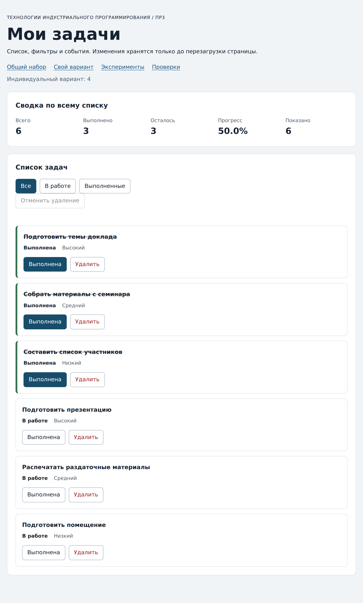

# Практическая работа № 3. Работа с DOM и событиями

## Данные работы

| Поле | Значение |
|---|---|
| Имя | Волков Матвей Михайлович |
| Группа | ЭФБО-05-25 |
| Вариант из ПР2 | 4 («Подготовка семинара», K = 3) |
| Node.js | v24.21.0 (npm 11.19.0) |
| Браузер | Google Chrome 148.0.7778.97 (headless) |
| Операционная система | Windows 11 + WSL2 (ядро Linux 6.6.87.2-microsoft-standard-WSL2) |

## Запуск

Рабочая папка: `practice-03` внутри личного репозитория.

```bash
npm run check:service
npm start
python3 -m http.server 5503
node tools/serve.mjs
```

Устанавливать зависимости через `npm install` не требуется. Для PowerShell при блокировке `npm.ps1` доступны `npm.cmd` и прямые команды `node`.

```text
http://127.0.0.1:5503/
http://127.0.0.1:5503/index.html?dataset=variant
http://127.0.0.1:5503/examples/dom-events.html
http://127.0.0.1:5503/checks.html
```

Остановка сервера: `Ctrl+C`. Для аудита использовался собственный запуск на `127.0.0.1:5503`; запуск и сценарии выполнялись автоматизированно через headless-браузер (WebDriver-протокол), при этом приложение управлялось настоящими DOM-событиями.

## Что перенесено из ПР2

- `src/task-service.js` — модуль из ПР2 (все 9 функций: `createTask`, `findTaskById`, `getPendingTasks`, `getTaskNames`, `getTaskStats`, `addTask`, `setTaskCompleted`, `renameTask`, `removeTask`). Перенесён без изменений: ошибки проектирования в ПР2 не обнаружены.
- `src/data.js` — из ПР2: общий контрольный набор `demoTasks` (`{id: 1, completed: true}`, `{id: 4}`, `{id: 7}`, `{id: 10, completed: true}`) и данные варианта 4: `variantNumber = 4`, 6 задач `11, 23, 37, 41, 58, 64`, первые три выполнены (`K = 3`), исходный прогресс 50.0 %.

Повторная проверка перенесённого модуля: `npm run check:service` → **35 из 35**. Входные данные и контракты сервиса в ПР3 не менялись.

## Эксперименты

| № | До запуска: прогноз | После запуска: результат | Объяснение |
|---:|---|---|---|
| 1. Отсутствующий элемент и коллекция | `document.querySelector("#absent")` вернёт `null`; обращение к `.title` у `null` даст `TypeError`. `querySelectorAll("#absent")` вернёт пустую коллекцию с `length = 0`, ошибки не будет. | `querySelector("#absent")` → `null` (объект); `querySelectorAll("#absent").length` → `0`; консоль браузера: `Пустая коллекция: 0`. Попытка прочитать `.title` у `null` действительно бросает `TypeError`. | `querySelector` возвращает один узел либо `null`; `querySelectorAll` возвращает `NodeList`, который существует всегда и имеет протокол коллекции (`length`, `forEach`, итерация). Пустая выборка — не ошибка, значит длина 0. |
| 2. dataset и числовой id | `dataset.taskId` — строка `"23"`; `Number("23")` — число `23`. | Консоль: `dataset.taskId: 23 string`; `Числовой id: 23`; `typeof Number(...)` → `"number"`. | Все data-атрибуты для DOM — строки. Для поиска в массиве число-идентификаторов (`findTaskById`) нужен явный `Number()`, иначе `"23" !== 23`. |
| 3. Статический NodeList | Один раз сохранённый `NodeList` не увидит добавленные записи — выборка статическая, нужен новый `querySelectorAll`. | До кликов: длина `1`. После 1-го клика: `Старый NodeList: 1`, `Новый querySelectorAll: 2`. После 2-го: `Старый NodeList: 1`, `Новый querySelectorAll: 3`. В DOM в итоге `3` элемента. | `querySelectorAll` возвращает **неживую** (статическую) выборку — снимок DOM на момент вызова. Любая последующая правка DOM не меняет старый объект выборки. |
| 4. Строка с HTML-разметкой | Назначение через `textContent` покажет теги как обычный текст, элемента `<strong>` не появится. | Заголовок принял значение `"<strong>Это текст, а не HTML</strong>"` (угловые скобки видны); в заголовке создано `0` элементов `strong`. | `textContent` вставляет строку как текстовый узел, не интерпретируя HTML. Если бы мы использовали `innerHTML`, браузер создал бы DOM-элемент `strong` — и это путь к инъекции разметки. |
| 5. Распространение события | Клик по вложенному `span.lab-label`: обход начинается с фазы захвата (1) на `lab-card`, затем обрабатывается событие на кнопке-предке и завершается всплытием (3) на `lab-card`. Так как цель — `span`, обработчик на кнопке сработает на фазе всплытия (3), а не на фазе цели (2). | Журнал после одного клика по `span`: `1. phase=1; target=lab-label; currentTarget=lab-card`; `2. phase=3; target=lab-label; currentTarget=lab-button`; `3. phase=3; target=lab-label; currentTarget=lab-card`. | Цель события — вложенный `span`. Слушатель с `{ capture: true }` вызывается до цели (фаза 1). Для слушателя на кнопке и на карточке нажатие уже всплывает: кнопа и карточка — предки цели, поэтому у них `eventPhase = 3`. `target` всегда исходный элемент, `currentTarget` — тот, на чьём слушателе выполняется код. |

## Организация кода

- `src/task-service.js` — слой данных из ПР2. Не знает о DOM: принимает/возвращает массивы записей и результат `{ ok, tasks, error }`.
- `src/data.js` — из ПР2: общий набор и вариант 4 (`variantTasks`, `variantNumber`).
- `src/task-selectors.js` — новый модуль: `getVisibleTasks(tasks, filter)` возвращает **новый** массив, не изменяет входной и не удаляет скрытые записи (фильтр применяется к копии).
- `src/task-view.js` — новый модуль отрисовки: `createTaskElement` (карточка `li.task-card[data-task-id]`, заголовок, статус, приоритет и две кнопки), `renderTaskList` (замена содержимого через `replaceChildren` — без накопления), `renderSummary` (сводка считается по **всему** списку через `getTaskStats`, отдельно выводится «Показано»), `renderEmptyState` (различает пустой список и пустой результат фильтра).
- `src/main.js` — состояние и события: полный список `currentTasks` и фильтр `currentFilter`; `renderApp` (перерисовка сама не трогает данные); делегирование кликов — один слушатель на `#task-list` (кнопки `toggle`/`delete`) и один на `#task-filters` (кнопки фильтров), чтобы добавление карточек не требовало новых подписок.
- `src/undo-history.js` — расширение «Вариант Б» (см. «Дополнительное задание»).

Полный список задач и активный фильтр хранятся в `main.js`; событие обрабатывается там же (делегирование); сводка вычисляется в `task-view.js` через `getTaskStats`.

## Общий сценарий

Ожидания — раздел 6.5 методички, проверено на `http://127.0.0.1:5503/index.html`. Порядок удалений: `4, 7, 1` (после завершения модели), как в методичке.

| Шаг | Видимые id | Всего | Выполнено | Осталось | Прогресс | Показано | Сообщение | Совпало с ожиданием |
|---:|---|---|---|---|---|---|---|---|
| 0 | 1,4,7,10 | 4 | 2 | 2 | 50.0% | 4 | — | да |
| 1 | 4,7 | 4 | 2 | 2 | 50.0% | 2 | — | да |
| 2 | 7 | 4 | 3 | 1 | 75.0% | 1 | — | да |
| 3 | 1,4,7,10 | 4 | 3 | 1 | 75.0% | 4 | — | да |
| 4 | 1,4,10 | 3 | 3 | 0 | 100.0% | 3 | — | да |
| 5 | — | 3 | 3 | 0 | 100.0% | 0 | Нет задач по выбранному фильтру. | да |
| 6 | 1,4,10 | 3 | 2 | 1 | 66.7% | 3 | — | да |
| 7 | — | 0 | 0 | 0 | 0.0% | 0 | Список задач пуст. | да |

После перезагрузки страницы: `currentTasks` снова инициализируется копией `demoTasks`, и приложение возвращается ровно к состоянию шага 0 (`1,4,7,10`, `50.0%`). Состояние живёт в памяти страницы и не сохраняется между сессиями; ни одна операция не меняет исходные объекты `data.js`.

## Индивидуальный вариант

Вариант 4, тема «Подготовка семинара», исходные задачи: `11 — Подготовить темы доклада`, `23 — Собрать материалы с семинара`, `37 — Составить список участников` (выполнены), `41 — Подготовить презентацию`, `58 — Распечатать раздаточные материалы`, `64 — Подготовить помещение` (в работе). Проверено на `http://127.0.0.1:5503/index.html?dataset=variant`.

Последовательность: проверка сводки, обход трёх фильтров, возврат во «Все», переключение статуса `id = 23` (была «Выполнена» → стала «В работе»), удаление `id = 37` (была «Выполнена»).

| Этап | Всего | Выполнено | Осталось | Прогресс | Видимые id |
|---|---|---|---|---|---|
| До действий | 6 | 3 | 3 | 50.0% | 11,23,37,41,58,64 |
| После переключения 23 | 6 | 2 | 4 | 33.3% | 11,23,37,41,58,64 |
| После удаления 37 | 5 | 1 | 4 | 20.0% | 11,23,41,58,64 |
| Итог, фильтр «В работе» | 5 | 1 | 4 | 20.0% | 23,41,58,64 |
| Итог, фильтр «Выполненные» | 5 | 1 | 4 | 20.0% | 11 |

Совпадение с методичкой: после двух действий выполнено `1` из `5`, итоговый прогресс `20.0%` — соответствует таблице вариантов. Итоговый набор: `id = 11, 23, 41, 58, 64`.

## Протокол проверки сервиса

Реальный вывод `npm run check:service`:

```text
OK: 01. Создание задачи с явным приоритетом
OK: 02. Приоритет по умолчанию
OK: 03. Удаление краевых пробелов без изменения внутренних
OK: 04. Граничные длины названия и положительный безопасный id
OK: 05. Некорректные названия при создании
OK: 06. Некорректные идентификаторы при создании
OK: 07. Все допустимые приоритеты и отклонение недопустимых
OK: 08. Каждый вызов createTask возвращает новый объект
OK: 09. Поиск по id, а не по индексу
OK: 10. Отсутствующая задача и пустой массив при поиске
OK: 11. Поиск не преобразует строковый id в число
OK: 12. Получение невыполненных задач
OK: 13. Пустой список, все выполнены и все не выполнены
OK: 14. Названия в исходном порядке и пустой список
OK: 15. Сводка по общему набору
OK: 16. Сводка по пустому списку
OK: 17. Сводка: ничего не выполнено и выполнено всё
OK: 18. Процент остаётся числом без предварительного округления
OK: 19. Добавление в конец без изменения входного массива
OK: 20. Добавление в пустой список с приоритетом по умолчанию
OK: 21. Повторяющийся id отклоняется
OK: 22. Добавление не обходит проверки createTask
OK: 23. Изменение completed в обе стороны
OK: 24. completed принимает только boolean
OK: 25. Некорректный или отсутствующий id при изменении статуса
OK: 26. Повторная установка статуса создаёт новый результат
OK: 27. Переименование сохраняет остальные поля
OK: 28. Проверки названия при переименовании
OK: 29. Некорректный или отсутствующий id при переименовании
OK: 30. Удаление по id с сохранением порядка
OK: 31. Удаление единственной записи
OK: 32. Некорректный, отсутствующий id и удаление из пустого списка
OK: 33. Входные объекты не изменяются ни одной операцией
OK: 34. Общий сценарий и все промежуточные сводки
OK: 35. Работа с другим набором, без зависимости от demoTasks

Проверок пройдено: 35; не пройдено: 0.
```

## Протокол браузерных проверок

Реальный текст из блока «Текстовый протокол» на `http://127.0.0.1:5503/checks.html`:

```text
OK: Фильтр all возвращает новый массив в исходном порядке
OK: Фильтр pending выбирает невыполненные задачи
OK: Фильтр completed выбирает выполненные задачи
OK: Все три фильтра работают с пустым списком
OK: Фильтрация не меняет входные записи и их порядок
OK: Карточка — li.task-card с числовым id в dataset
OK: Статус невыполненной карточки и aria-pressed согласованы
OK: Статус выполненной карточки и aria-pressed согласованы
OK: В карточке две обычные кнопки с вложенными подписями
OK: Все приоритеты отображаются по установленному словарю
OK: Название с разметкой отображается текстом
OK: Отрисовка списка создаёт карточки в исходном порядке
OK: Повторная отрисовка не накапливает карточки
OK: Контейнер списка и его обработчик сохраняются
OK: Отрисовка пустого массива очищает прежние карточки
OK: Сводка считается по всему списку, отдельно выводится Показано
OK: Пустая сводка не содержит NaN и Infinity
OK: Сообщение для полностью пустого списка
OK: Сообщение для пустого результата фильтра
OK: Появление карточек скрывает прежнее пустое состояние
OK: Приложение: начальный набор и сводка
OK: Приложение: фильтр срабатывает по клику на вложенный span
OK: Приложение: активный фильтр отмечен классом и aria-pressed
OK: Приложение: фильтрация не удаляет скрытые задачи
OK: Приложение: переключение по id, а не индексу массива
OK: Приложение: выполненная задача исчезает из фильтра В работе
OK: Приложение: удаление изменяет данные, а не только DOM
OK: Приложение: клик по названию не изменяет данные
OK: Приложение: после перерисовок одно нажатие — одно изменение
OK: Приложение: удаление всех записей и нулевая сводка
OK: Приложение: нет совпадений — не то же самое, что нет задач
OK: Приложение: неизвестный числовой id не меняет данные
OK: Приложение: id 4abc не превращается в 4
OK: Приложение: неизвестное действие игнорируется
OK: Приложение: после изменения сохраняется клавиатурный фокус
OK: Приложение: новая загрузка возвращает исходное состояние

Всего: 36. Пройдено: 36. Ошибок: 0.
```

Итог: **36 из 36**.

## Собственные проверки

Для каждого случая выполнен реальный запуск приложения (headless-браузер, подлинные клики по вложенным `span`).

| № | Исходное состояние и действия | Ожидаемый результат | Фактический результат | Итог |
|---:|---|---|---|---|
| 1 | Состояние «Все», два клика подряд «Выполнена» на карточке `id = 7` (граничное: повторное переключение туда-обратно) | После 1-го клика 3 выполнено, прогресс 75.0%; после 2-го возврат к исходному: 2 выполнено, 50.0%; карточек всегда 4 | 1-й клик: `75.0%`, 2-й клик: `50.0%`, каждый раз `li = 4 = показано`, сообщений нет | совпало |
| 2 | Удалить `id = 7`, перейти «В работе», вернуться «Все»; проверить контейнер и количество карточек (событие/повторная отрисовка) | `#task-list` не заменяется (тот же DOM-узел); карточек ровно столько, сколько «Показано», без накопления | после трёх операций `li = 3 = shown`, узел `#task-list` идентичен сохранённому (`true`) | совпало |
| 3 | Состояние «Все», клик по заголовку `h3.task-title` карточки `id = 7` (клик не по кнопке действия) | Действие не распознаётся: данные и сводка не меняются, сообщений нет | `ids=[1,4,7,10]`, прогресс `50.0%`, `msg=""` — без изменений | совпало |
| 4 | Во «В работе» (`4,7`): удалить `4`, затем переключить `7` (граничное: фильтр становится пустым) | Пустая выборка фильтра, сообщение «Нет задач по выбранному фильтру.»; сводка по всем записям 100.0% | `ids=[]`, `shown=0`, прогресс `100.0%`, сообщение точно «Нет задач по выбранному фильтру.» | совпало |

## Отладка и клавиатура

Точка останова: в `src/main.js`, строка 54 — `const id = Number(card.dataset.taskId)` в обработчике `handleTaskListClick` (подписка — строка 134). Значения, полученные в отладчике при кликах по вложенному `span.action-label`:

| Событие | `event.target` | `event.currentTarget` | `dataset.taskId` | числовой `id` (`typeof`) | `action` | результат сервиса |
|---|---|---|---|---|---|---|
| toggle `id = 1` | `SPAN.action-label` | `UL#task-list` | `"1"` (string) | `1` (number) | `toggle` | `setTaskCompleted` → `ok: true`, длина массива не меняется, `aria-pressed` кнопки = `true` |
| delete `id = 4` | `SPAN.action-label` | `UL#task-list` | `"4"` (string) | `4` (number) | `delete` | `removeTask` → `ok: true`, `tasks.length` уменьшается на 1, записи `id = 4` в результате нет |

Клавиатура:

- **Tab**: по умолчанию проходит 4 ссылки страницы и 3 кнопки фильтров; кнопка «Отменить удаление» выключена (начальное состояние) и потому пропускается; далее фокус идёт по кнопкам карточек (первая — после 8-го Tab).
- **Enter/Space**: активируют нативную кнопку (генерируется событие `click`), состояние меняется так же, как от мыши.
- **Фокус после изменения**: после `toggle` фокус остаётся на той же кнопке (за это отвечает `restoreTaskFocus`, `src/main.js:125`); после `delete` карточка исчезает, и фокус переходит на активную кнопку фильтра. Проверено и автоматизированно: после Enter по `toggle` активен тот же `button[data-action="toggle"]`; после пробела по «Удалить» фокус на `button[data-filter="all"]`.
- **Отказ `777`**: `Number("777")` — безопасное целое, но записи с таким id нет → `removeTask` возвращает `{ ok: false, error }`, сообщение «Задача не найдена», массив и история не меняются.
- **Отказ `4abc`**: `Number("4abc")` идёт как `NaN`, проверка `Number.isSafeInteger` не проходит → сообщение «Некорректный идентификатор задачи», состояние без изменений (проверка того, что строка с буквами не превращается в число `4`).

## Вид приложения

Скриншот после собственного запуска (`index.html?dataset=variant`):



## Дополнительное задание

Выполнено — **Вариант Б «Однократная отмена последнего удаления»**.

Реализация: кнопка `«Отменить удаление»` (`#undo-button`) в отдельной группе `#task-undo` (вне `#task-filters`, чтобы не затронуть контракт фильтров и проверки ПР3); история в новом модуле `src/undo-history.js` (`rememberRemoval` / `restoreRemoval`); связывание в `main.js` (`handleUndoClick`, `updateUndoButton`). Функции ПР2 (`removeTask` и др.) не изменялись.

Правила поведения:

1. Кнопка выключена (`disabled`, `aria-pressed="false"`), пока нет удаления, которое можно отменить.
2. После удаления запоминается копия последней записи (все поля: `id`, `title`, `completed`, `priority`) и её прежний индекс в массиве.
3. «Отменить удаление» восстанавливает запись **на прежнюю позицию** с исходными статусом и приоритетом; сводка и список пересчитываются обычным `renderApp`.
4. Отмена **однократна**: после восстановления история очищается, кнопка снова выключается; повторная отмена невозможна.
5. Новое удаление заменяет предыдущую запись истории (можно отменить только последнее удаление).
6. Неудачное удаление неизвестного id не трогает ни массив, ни историю.
7. Отмена работает при любом активном фильтре: восстановленная запись появляется в списке, если проходит текущий фильтр, и всегда — в сводке.

Проверки расширения (все выполнены реальными запусками):

| № | Исходное состояние и действия | Ожидаемый результат | Фактический результат | Итог |
|---:|---|---|---|---|
| 1 | Начало; удалить `id = 7`; нажать «Отменить удаление» | Кнопка: выключена → активна (`aria-pressed="true"`) → снова выключена | отмечено `disabled: true`, затем `disabled: false / pressed: true`, затем `disabled: true / pressed: false` | совпало |
| 2 | Удалить `id = 4` (позиция 2, «В работе», приоритет «Высокий»); нажать «Отменить удаление» | Восстановление на позицию 2 с прежними статусом и приоритетом, сводка `2/2/50.0%` | карточка id=4 снова `pos = 2`, статус «В работе», приоритет «Высокий», прогресс `50.0%` | совпало |
| 3 | Удалить `7`, затем `10`; попытка удаления несуществующего `777`; нажать «Отменить удаление» | Историю не перезаписывает неудача; отмена возвращает **только последнее** удалённое (`10`), набор `1,4,10` | до отмены кнопка осталась активной после `777`; после отмены `ids=[1,4,10]` (вернулась `10`, а не `7`) | совпало |

## Вывод

Реализовано и проверено приложение со слоем данных (ПР2), селекторами, отрисовкой и обработкой событий. Прогнаны сервисные проверки (**35/35**) и браузерные (**36/36**): и общий сценарий, и вариант 4 целиком совпали с ожиданиями методички. Эксперименты показали разницу между статической выборкой и живым DOM, между `textContent` и `innerHTML`, а также правила распространения событий (фазы захвата/всплытия, `target` против `currentTarget`).

Ключевое различие: изменение данных — это работа функций сервиса (`setTaskCompleted`, `removeTask`, …), которые возвращают новый массив и никогда не мутируют входные записи; изменение DOM — это перерисовка `renderApp`, которая только отражает текущее состояние массива. Одна операция с данными всегда вызывает один перерисовку, контейнеры и слушатели при этом сохраняются, а фокус возвращается на исходную позицию. Расширение «Вариант Б» добавляет однократную отмену последнего удаления без изменения сервиса ПР2.